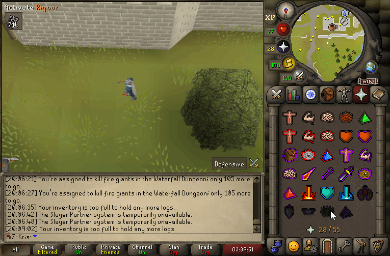

# Interface Interactions

Interface interactions refer to the scripts that get executed when the player clicks on any interface component.
This includes the interactions done with the items within the players inventory, equipment and such.
While these scripts are suspendable, they cannot fully be used in the manner that queues and [interactions](entity-interactions#entity-interactions)
can. Interface interactions can only suspend for pause-button resume events, such as dialogues and input events.
They cannot be paused for other purposes, such as delaying the execution of the code for a few ticks.

## Conditions

Only one interface script may be paused at a time. However, unlike queues and [interactions](entity-interactions#entity-interactions),
multiple scripts may pause and resume within the same game tick. This can happen because interface scripts are executed
immediately upon being received. The paused script will be resumed when the respective "Resume Button" packet is received.
If multiple valid interface clicks that suspend the script are sent on the same tick with the correct
resume pause button packets in-between each one, multiple scripts will execute that same tick.
In addition to this, while only one script may be paused at a time, you cannot know whether the script behind
the next interface click is going to suspend that script or not. Because of this, each script must be executed
on a state machine(such as a coroutine), after the execution of which we can determine whether the script paused or not.
If the script did pause, the previous paused script would be replaced with the new one.

---

Interface interaction scripts may only be resumed by the following packets:
- Resume Pause Button - used primarily by the "click here to continue" button on dialogues.
- Resume P Count Dialog - used for input integers, such as how many items to withdraw from the bank.
- Resume P Name Dialog - used for player name inputs, for example to join another player's clan.
- Resume P Obj Dialog - used by the item selection dialogue in Grand Exchange, to inform the server of the item the player chose.
- Resume P String Dialog - used for text inputs, like the bug abuse report form.

## Interruptions

Interface scripts are heavily interruptible. Any action that would close a modal interface - or open another one - 
will also cancel an interface interaction. In addition to this, because only one script may ever be 
paused at any given time, if another script gets paused while one is already paused, the previous one
will get cancelled.

## Media

*Demonstrates interface click scripts executing immediately. In the gif, the piety prayer is clicked to
launch the requirement-dialogue. After that, the rigour prayer is clicked, which is immediately followed
by pressing the "Click here to continue" button on the dialogue from the piety requirement dialogue.
The reason behind clicking piety in the first place is to open up a dialogue which we can then use to send
the resume pause button packet. Even though the rigour prayer was clicked, the requirement-dialogue for it
never appears, because the pause button sent off by the previous piety requirement-dialogue resumes the script
the same exact tick on which it was paused. Therefore, the dialogue is opened and closed on the same exact tick.*

