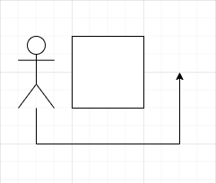
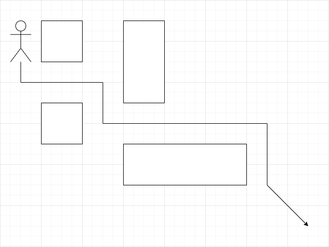

# Random Walk Mechanic

Random walk is a mechanic used by NPCs to roam around the game.
NPCs which aren't doing anything(moving, interacting) have a chance to
determine a path to a random location within their [wander range](../variables/wander-range.md#wander-range).

## Conditions

NPCs may only wander if they aren't currently occupied by some other activity, such as combat.
Based on the erratic paths that the NPCs take - moving in one direction, then suddenly going in the opposite one,
we can assume that wandering may occur even if the NPC has some movement queued up.
NPCs with a [wander range](../variables/wander-range.md#wander-range) or [max range](../variables/max-range.md#max-range) of 0
can never move from their spot.

## Probability

The probability of a NPC wandering can be found in early HD clients, which supported the animated login backgrounds.
The code in those clients dictates that the probability of a NPC random walking is 10/1,000 per client tick.
As there are 30 client ticks in one server tick, the actual probability of the random walk happening server-side
would be 30 x 10/1,000.

We do not currently know whether Jagex accounted for repeated event probability when they added random walking
to the clients, therefore it is unclear if the probability should simply be 300/1,000, or account for the repeated
events as 1 - (1 - (10 / 1,000))<sup>30</sup> = 0.26029962661172, giving us a 260/1,000 probability.

## Client Code

Below is the code block that is responsible for random walking in the HD clients which supported animated login
backgrounds. Note that the code is still heavily obfuscated. Parts of it have been renamed to make it easier to understand.

Based on the code, we can gather the following facts:
- The NPCs use the intelligent pathfinder for calculating random movement.
- All NPCs in the client have a fixed [wander range](../variables/wander-range.md#wander-range) of five squares.
- The client caps random movement calculations to a maximum of nine turns. The equivalent for player paths
in the server in OldSchool RuneScape is 24.
- The NPCs in the client only have a chance to roll for the random movement if they don't already have
movement pending.
- The probability of a NPC moving per client tick, if it isn't already moving and supports random movement
is 10/1,000.
- The pathfinder has alternative paths enabled for random movement, meaning if the path to the exact square
cannot be found, it will instead try to find the closest approach point within ten tiles of that square.

```java
for (int npcIndex = 0; npcIndex < 32768; npcIndex++) {
    NPC npc = Class23_Sub4_Sub2.npcList[npcIndex];
    if (npc != null) {
        byte i_13_ = npc.npcDefinitions.aByte867;
        if ((i_13_ & 0x1) != 0) {
            int size = npc.getSize((byte) -106);
            if ((i_13_ & 0x2) != 0 && (npc.pathLength == 0) && Math.random() * 1000.0 < 10.0) {
                int xOffset = (int) Math.round(-5.0 + Math.random() * 10.0);
                int yOffset = (int) Math.round(Math.random() * 10.0 - 5.0);
                if (xOffset != 0 || yOffset != 0) {
                    int destX = (xOffset + npc.xWaypath[0]);
                    int destY = (yOffset + npc.yWaypath[0]);
                    if (destX >= 0) {
                        if (-1 + (-size + (Class131_Sub41_Sub11_Sub1.map_sizeX)) < destX) destX = -size + (Class131_Sub41_Sub11_Sub1.map_sizeX) + -1;
                    } else destX = 0;
                    if (destY >= 0) {
                        if ((-size + Class131_Sub2_Sub26.mapSizeY + -1) < destY) destY = (-size + (Class131_Sub2_Sub26.mapSizeY - 1));
                    } else destY = 0;
                    int turns = (Class143.calculateRoute(npc.yWaypath[0], 0, npc.xWaypath[0], 0, Class131_Sub2_Sub18.anIntArray5821, true, -12757,
                            IntegerNode.anIntArray4473, size, size, destY, -1, destX, size, (Class131_Sub2_Sub9.aClass19Array5682[npc.aByte3740])));
                    if (turns > 0) {
                        if (turns > 9) turns = 9;
                        for (int i = 0; turns > i; i++) {
                            npc.xWaypath[i] = (Class131_Sub2_Sub18.anIntArray5821[-1 + -i + turns]);
                            npc.yWaypath[i] = (IntegerNode.anIntArray4473[-1 + (-i + turns)]);
                            npc.aByteArray5322[i] = (byte) 1;
                        }
                        npc.pathLength = turns;
                    }
                }
            }
            Class91.method844(false, npc, true);
            int i_21_ = Class131_Sub18.method1807(npc, 16383);
            Class19.method251(npc, i_21_, Class131_Sub41_Sub21.anInt6446, (byte) -124, Class182.anInt2605);
            Class75.method761(npc, (byte) -96);
        }
    }
}
```

## Observations
The below observations were done on the [goblins](https://oldschool.runescape.wiki/w/Goblin) and [cows](https://oldschool.runescape.wiki/w/Cow)
found in [Lumbridge](https://oldschool.runescape.wiki/w/Lumbridge):
- The NPCs would occasionally walk behind another NPC or player, and wait until they moved, so the NPC could move forward.
However, this would not happen indefinitely, as the NPC would often just calculate another path and go there instead.
The same could also be seen in the midst of normal paths, the NPC would very frequently just turn in the complete
opposite direction of where they were headed.
- The probability of random movement seems to be around what could be found in the client.
- NPCs would often walk long paths, as long as their [wander range](../variables/wander-range.md#wander-range) supported them,
and they weren't interrupted by obstructing objects or other entities.
- The movement of the NPCs indicates the use of the dumb pathfinder:
  - The NPCs would almost never go around objects in the manner shown in the [invalid movement picture](#invalid-movement).
  - They would however very often slide against objects as shown in the [valid movement picture](#valid-movement).

While the NPCs could *sometimes rarely* go in the movement depicted in the [invalid movement picture](#invalid-movement),
it was very rare to see this. The phenomenon could be explained by two random movements chaining together.

### Invalid movement



### Valid movement




## Server-sided implementation

Due to the observations done above, we can make the assumption that the OldSchool RuneScape does not use
the intelligent pathfinder for random movement. The dumb pathfinder used by NPCs everywhere else seems to fall
perfectly in line with the behaviors observed. The dumb pathfinder that seems to be used for NPC random movement
can be found [here](https://github.com/runelite/runelite/blob/master/runelite-api/src/main/java/net/runelite/api/coords/WorldArea.java).
Using the `calculateNextTravellingPoint()` function, we can create a path that matches our observations perfectly.
The thing to keep in mind however is, this dumb pathfinder should ignore entity collisions entirely.
However, further down the road where the path is actually processed, the processing should be halted if
an entity collision prevents going forward. The path should not be cleared if that is the case though,
as NPCs tend to continue moving in their previous paths if you stop obstructing them, unless another path
is calculated before that.

## Media


*NPC random movement being observed. The gif shows how walking away from in front of a goblin 
allows it to continue moving on the same path. In addition to this, it shows numerous examples of
the [valid movement](#valid-movement) paths occurring, without it ever looking like the one seen in
the [invalid movement picture](#invalid-movement).*