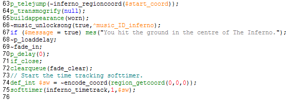
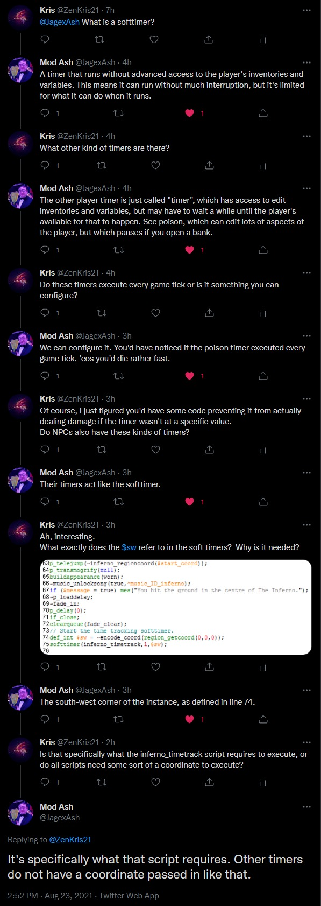

# Timers

The timers' system is used to execute periodic scripts for players and NPCs.
Each timer can only execute at a defined interval. The timer will start at the given interval,
and count down until it reaches zero, upon which the script itself is invoked.
Timers execute before queues for NPCs, and after queues for players.
Timers do not execute on the tick on which they were queued. This is important to keep in mind,
as this is what allows prayer-flicking to not drain prayer points in OldSchool RuneScape.
New timers are presumably queued into a separate collection. During the processing part of timers,
existing timers are ticked down and processed if needed. After that, the new timers' collection is iterated,
and the respective timers are moved onto the existing timers' collection. *The new timers do not get executed this tick.*

There are two types of timers in OldSchool RuneScape - soft timers and normal timers.

### Soft Timers

Soft timers can be used by NPCs as well as players. In the case of players however, they do not have advanced
access to the player, meaning they cannot change or read the player's inventories or variables.
Soft timers tick down regardless of the state of the entity, as long as they haven't completely
been removed from the game.

### Normal Timers

Normal timers are unique only to players. They are used for scripts which require advanced access to the player itself.
While normal timers do tick down without interruptions, the contents of the script may only execute if the
player has not got a modal interface open, and is not under the effects of a stall at the moment.
If the player does not meet the aforementioned conditions when the timer reaches zero, the timer halts.
Each tick that follows, it will try to execute the script until it finally can, after which the timer is set
back to the period with which it was originally launched.

## Known timers

### Soft Timers

- Player soft timers:
  - Divine potions.
  - Overloads.
  - Antifires.
  - Anti-toxin potions(Relicym's balm, antipoison, anti-venom and all the other variations).
  - Stat enhancements/debuffs.
  - Immunities(freeze, teleblock).
  - Stamina enhancement.
  - Prayer enhance
  - Imbued heart cooldown.
  - Toxic staff of the dead's special attack.
  - Morrigan's throwing axe special attack.
  - Vengeance cooldown.
  - Hunter trap collapsing.
  - Tracking boss fight durations.
- NPC soft timers(*List is still very incomplete at this time*):
  - Respawning.
  - Fishing spot periodic teleportation.
  - Toxins(poison, venom, disease).

### Normal Timers

*As NPCs only support soft timers, this section only applies to players.*

- Toxins(poison, venom, disease).
- Dwarf multicannon.
- Wine fermentation.
- Magic Imbue spell.
- Prayers.
- Farming:
  - While farming runs at an interval of five minutes, the time until the initial execution varies. Farming is synchronized with
  real-time clocks.
  - Cut-down farming trees execute on a separate timer.

## Media

*The gif below demonstrates the delaying of poison execution. With the assistance from RuneLite,
we can tell that the poison should have executed twice in the time the interface was open.
Upon closing the interface, the poison will go off once that same server tick.*

---

*A leak by Mod Ash showing the RuneScript code behind queueing a soft timer.
The `$sw` coordinate is an argument that the `inferno_timetrack` script requires.*

---

*A series of tweets by Mod Ash explaining the timers' system in depth.*

---

## References
1. [Mod Ash Tweets](https://twitter.com/ZenKris21/status/1429701903626211334)