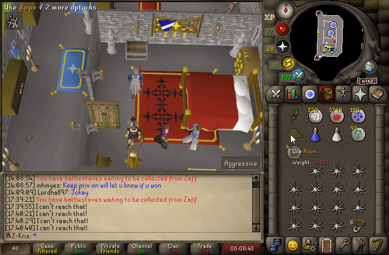
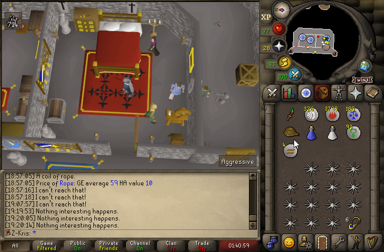

# Interactions

The interaction system refers to players interacting with either map objects, ground items,
other players or NPCs. This includes item-on-entity as well as
interface-component-on-entity(generally known as spell-on-entity) interactions.

## Behaviors

The interaction system is split into two sub-branches - mobile entity interactions and
immobile entity interactions. Interactions with players and NPCs fall into the mobile category,
whereas ground items and map objects fall into the immobile one.
The primary difference between the two categories is the execution order.
The mobile category will be executed after player movement is processed,
whereas the immobile one will execute prior to player's movement processing.
The direct effect of that is that mobile interactions can happen at a visible distance,
whereas for objects you will first walk up to them, before the interaction can execute.
Do note that while mobile interactions visually execute prior to you taking the final step,
failed interactions will however be delayed similarly to how map objects get executed.
The effects of this can be seen on the first two gifs in [media](#Media).
The failed one will only send a message upon arriving at the destination,
whereas the successful one will execute from a distance.

## Conditions

Only one branch of interactions can be active at a given moment, meaning, for example,
you can never interact with a player whilst also interacting with a map object.
Interactions can happen in two ways:
- From a distance:
  - In OldSchool RuneScape, each click option can have its own approach distance defined,
  meaning that for example, the "Talk-to" option could execute at a distance of five squares,
  whereas "Trade" would require you to walk up to the entity.
  - Distanced interactions use line of sight to determine whether the interaction can occur.
  This means, however, that the player must ensure themselves that they are interacting with the
  entity from a direction in which they can get line of sight. While it does use the intelligent
  pathfinder to generate the path, in cases where the entity itself is behind a barrier -
  such as a banker, it will not be able to pathfind directly next to them. Instead, however,
  the pathfinder will find an alternative path that is both closest to your current position
  and closest to the entity with which you are interacting. The effects of this can be seen
  in the [media](#Media) section below, as the first gif.
- Within interaction distance:
  - Requires the player to walk up to the entity it is interacting with before the interaction
  can execute.
  - Can only execute if there are no obstructions between the player and the entity itself.
  Line of sight alone is not sufficient here.

## Media

*Demonstrates a failed distanced interaction:*

---

*Demonstrates a successful distanced interaction:*

---

*Demonstrates an immobile interaction that hasn't got a script associated with it.
The player has to arrive by the object before the "Nothing interesting happens." message can be sent:*

---

*Demonstrates a mobile interaction that hasn't got a script associated with it.
The "Nothing interesting happens." message is sent immediately with a visible one square distance:*

