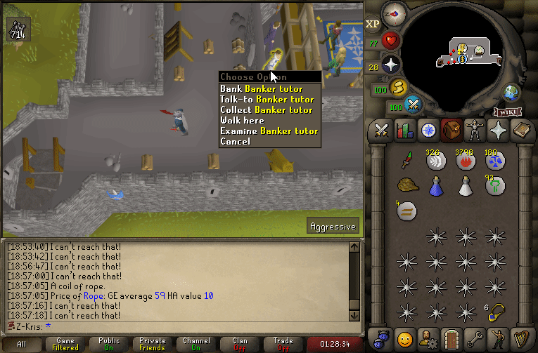
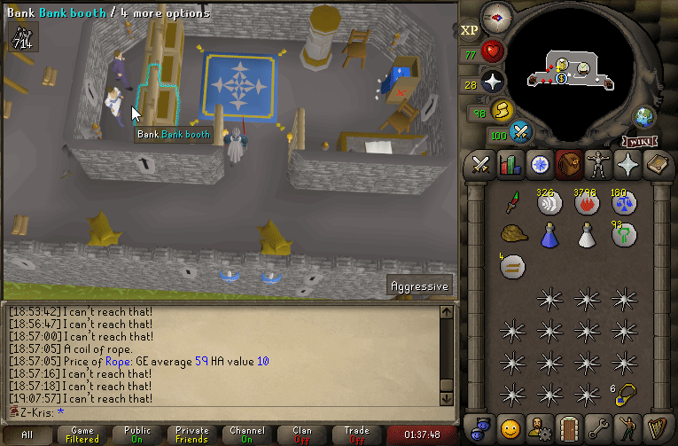

# Interactions

The interaction system refers to players interacting with either map objects, ground items,
other players or NPCs. This includes item-on-entity as well as
interface-component-on-entity(generally known as spell-on-entity) interactions.

## Behaviors

The interaction system is split into two sub-branches - mobile entity interactions and
immobile entity interactions. Interactions with players and NPCs fall into the mobile category,
whereas ground items and map objects fall into the immobile one.
The primary difference between the two categories is the execution order.
The mobile category will be executed after player movement is processed,
whereas the immobile one will execute prior to player's movement processing.
The direct effect of that is that mobile interactions can happen at a visible distance,
whereas for objects you will first walk up to them, before the interaction can execute.
Do note that while mobile interactions visually execute prior to you taking the final step,
failed interactions will however be delayed similarly to how map objects get executed.
The effects of this can be seen on the first two gifs in [media](#Media).
The failed one will only send a message upon arriving at the destination,
whereas the successful one will execute from a distance.

## Conditions

Only one branch of interactions can be active at a given moment, meaning, for example,
you can never interact with a player whilst also interacting with a map object.
Interactions can happen in two ways:
- From a distance:
  - In OldSchool RuneScape, each click option can have its own approach distance defined,
  meaning that for example, the "Talk-to" option could execute at a distance of five squares,
  whereas "Trade" would require you to walk up to the entity.
  - Distanced interactions use line of sight to determine whether the interaction can occur.
  This means, however, that the player must ensure themselves that they are interacting with the
  entity from a direction in which they can get line of sight. While it does use the intelligent
  pathfinder to generate the path, in cases where the entity itself is behind a barrier -
  such as a banker, it will not be able to pathfind directly next to them. Instead, however,
  the pathfinder will find an alternative path that is both closest to your current position
  and closest to the entity with which you are interacting. The effects of this can be seen
  in the [media](#Media) section below, as the first gif.
- Within interaction distance:
  - Requires the player to walk up to the entity it is interacting with before the interaction
  can execute.
  - Can only execute if there are no obstructions between the player and the entity itself.
  Line of sight alone is not sufficient here.

## Implementation

All interactions are fully suspendable, meaning the scripts can be paused at any given time, and executed later
down the line. Interactions themselves are not tied to route events. When a player clicks on a map object for example,
the game will launch a route event to that map object. Upon arriving at that map object, the interaction will be launched,
and the route event ends.

Interactions such as clicking the "Attack" option on an NPC will launch a route event with an approach distance
of ten squares. Upon arriving at the appropriate location for the interaction to execute, the route event ends.
However, because combat requires continuous pathfinding to the target, combat interaction itself launches
a repeated route event at the target, which can never end by itself. This will ensure that the player keeps
following their target, while the interaction itself simply compares the distances to ensure combat can execute.
The interaction itself does not have to worry about moving the player to the necessary coordinates.
If the player unequips their weapon, the interaction does not cancel. However, because different weapons
can have different attack distances(and some require line of sight, while others require full path),
we must update the route event to one that matches the now-unarmed player.

### Interruptions

Interactions can only cancel with hard interruptions, such as:
- Launching another interaction.
- Death and other similar events which manually cancel interactions.
- Player-invoked teleportation(E.G. clicking on [Varrock Teleport](https://oldschool.runescape.wiki/w/Varrock_Teleport)).
- Certain interface buttons, such as the "View equipment stats" button on the equipment tab interface.
- All item interactions within inventory. The same does not however apply when interacting from within the
equipment tab.

---

Interactions will pause when:
- A modal interface opens up.
- An active queue exists.
  - ***Yet to prove this!***

---

Interactions do **not** get interrupted or paused by the following:
- Interface clicks(outside the exceptions mentioned above).

## Use-cases

Contrary to popular belief, actions such as [combat](https://oldschool.runescape.wiki/w/Combat), 
[woodcutting](https://oldschool.runescape.wiki/w/Woodcutting), 
[fishing](https://oldschool.runescape.wiki/w/Fishing), 
[mining](https://oldschool.runescape.wiki/w/Mining) and many other map object and npc-interaction
actions do not run off of the queue system.
Instead, they run straight off of the same interaction script that originally launched from
the route event.

This can be proven by the following fact:
- Because queues process before route events, it would not be possible for the aforementioned
actions to execute on the tick on which the entity was clicked. Therefore, for example,
spam-clicking trees would continuously reset the action, not allowing for a roll at the logs.

## Media

*Demonstrates a failed distanced interaction:*

---

*Demonstrates a successful distanced interaction:*

---

*Demonstrates an immobile interaction that hasn't got a script associated with it.
The player has to arrive by the object before the "Nothing interesting happens." message can be sent:*

---

*Demonstrates a mobile interaction that hasn't got a script associated with it.
The "Nothing interesting happens." message is sent immediately with a visible one square distance:*

---

*Demonstrates an interaction getting paused by a modal interface. After closing the interface,
the interaction continues as normal:*

