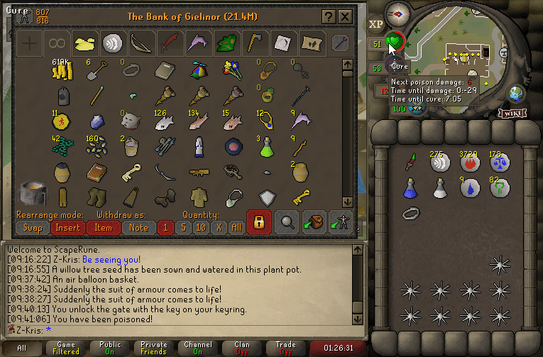

*This thread is still under construction and may experience significant changes in the future.
A lot of the information provided here is theoretical and yet to be tested in depth.*

---

# Timers

Timers refer to events that are processed every server tick for all the active events.
Timers are not to be confused with boss kill timers or clocks, although both of those may be used within
the timers.

## Conditions

Timers execute every single server tick for which they are queued on the entity. This does not however mean
that all timers will always alter the entity. A lot of the timers seem to have checks for if the entity is
under a stall, or the player(if the timer is scheduled on a player) has any modal interfaces open.
None of this applies to all the timers, therefore these conditions must be checked on a per-timer basis.

## Known timers

Below is a list of known timers, and the conditions under which they can execute.

- Toxins(poison, venom, disease):
  - Toxins have a unique processing mechanic to them, compared to the rest of the timers. They make use of the clock
  system to determine when the respective toxin execution should occur. Toxins will not execute if there is an ongoing stall,
  or if the player has a modal interface open. However, because it uses the clock system to determine when poison
  should go off, the toxin will still get processed when the entity is no longer stalled or has a modal interface
  open. So, for example, if there are five server ticks until the next poison hit should occur, and you open a modal interface
  for ten server ticks, upon closing the interface, the toxin will execute immediately. During the execution,
  the clock will then be reset to next execute 30 server ticks from then. You cannot queue up multiple toxin executions.
- Dwarf multicannon, Magic Imbue spell, wine fermentation:
  - All of these can only process while the entity is not under a stall and does not have a modal interface open.
  - ***Still need to test if wine fermentation and multicannon use clocks alongside, or get fully delayed.***
- Divine potions, overloads, antifires, anti-toxin potions(e.g. Relicym's balm), stat enhancements/debuffs,
immunities, stamina enhancement, prayer enhance, imbued heart cooldown, Toxic staff of the dead's special attack,
Morrigan's throwing axe special attack, vengeance cooldown:
  - All of these run independently, meaning they do not care if there is an ongoing stall or if a modal interface is open.
- Farming:
  - Farming executes off of the timers, but it uses the clock system to determine whether a farming cycle has passed.
  Farming runs at a five-minute interval, real-time, for all players. However, farming cannot process if the
  player has an ongoing stall, or a modal interface open. Those simply delay the execution. The processing happens
  by comparing the last farming process cycle against the current real-time farming cycle. If both cycles are
  equivalent to one another, farming does not need to process. If the last process cycle is less than the current,
  by say three cycles, it will loop farming process method for three cycles within the timer.
- Hunter traps:
  - Unlike farming, hunter will process even if there is an ongoing stall or the player has a modal interface.
  In addition to this, all hunter traps the player has placed will immediately collapse upon logout.
- Fishing spots:
  - *This timer is linked to the fishing spot NPC itself. It has no relation to players, unlike everything above.*
  - Almost all fishing spots will periodically shift their position in the game. The only exceptions to this are
  karambwan fishing spots and frogspawn fishing spots. Most, but not all, fishing spots shift position every
  three to five minutes. The actual delay between the shift is random between those values. This means however,
  they use the clock system to determine when the next shift should occur.
  
## Media

*The gif below demonstrates the delaying of poison execution. With the assistance from RuneLite,
we can tell that the poison should have executed twice in the time the interface was open.
Upon closing the interface, the poison will go off once that same server tick.*

